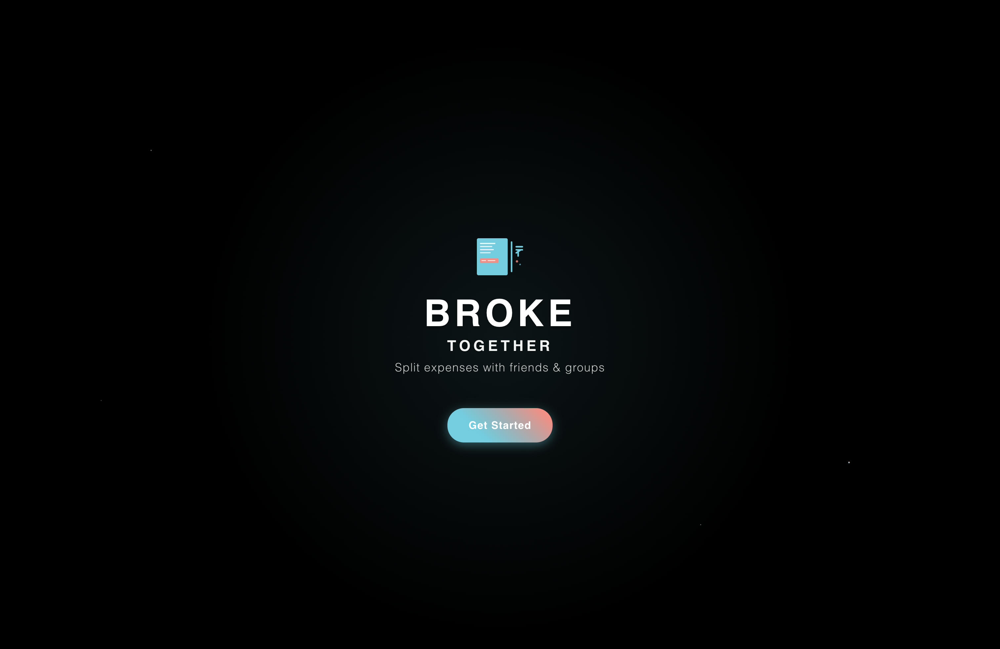
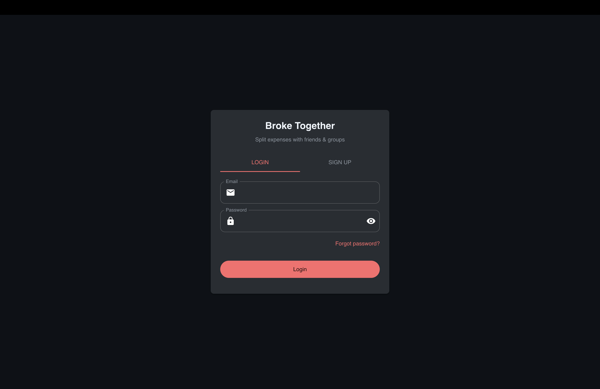
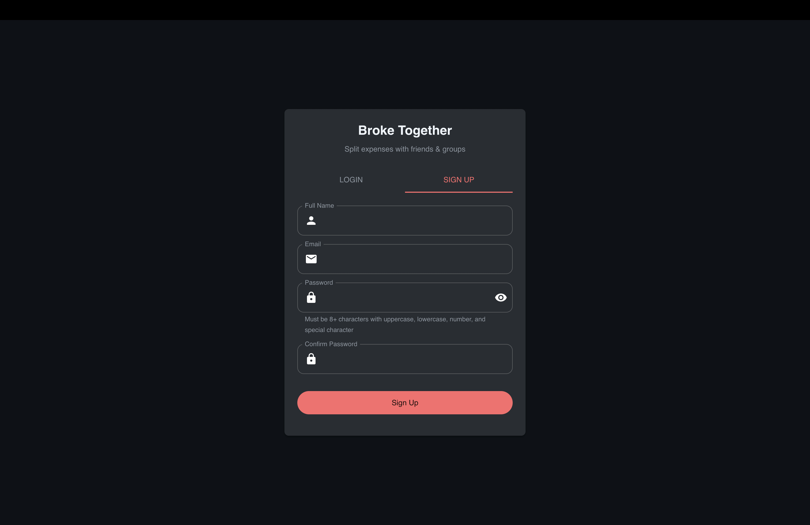
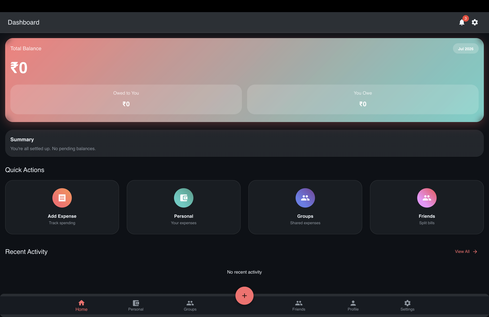
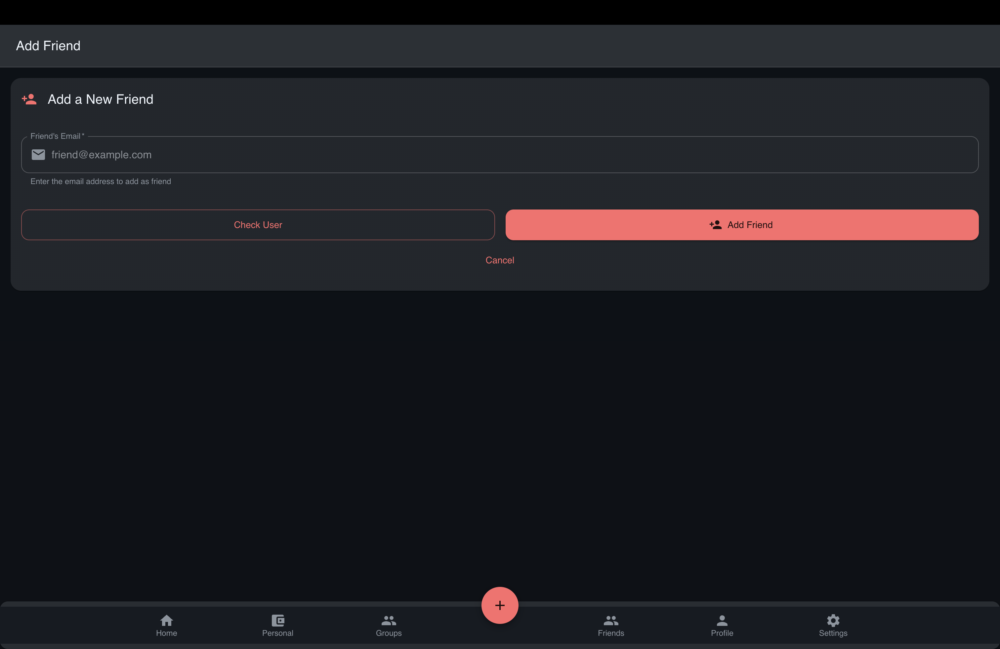
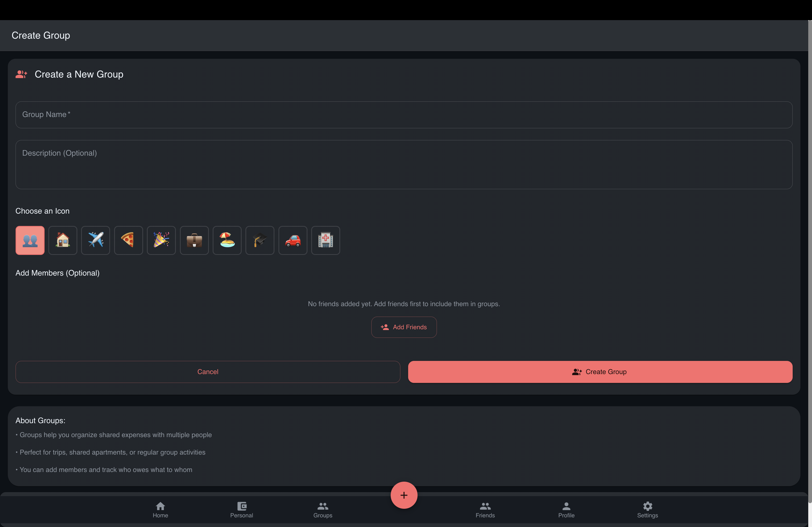
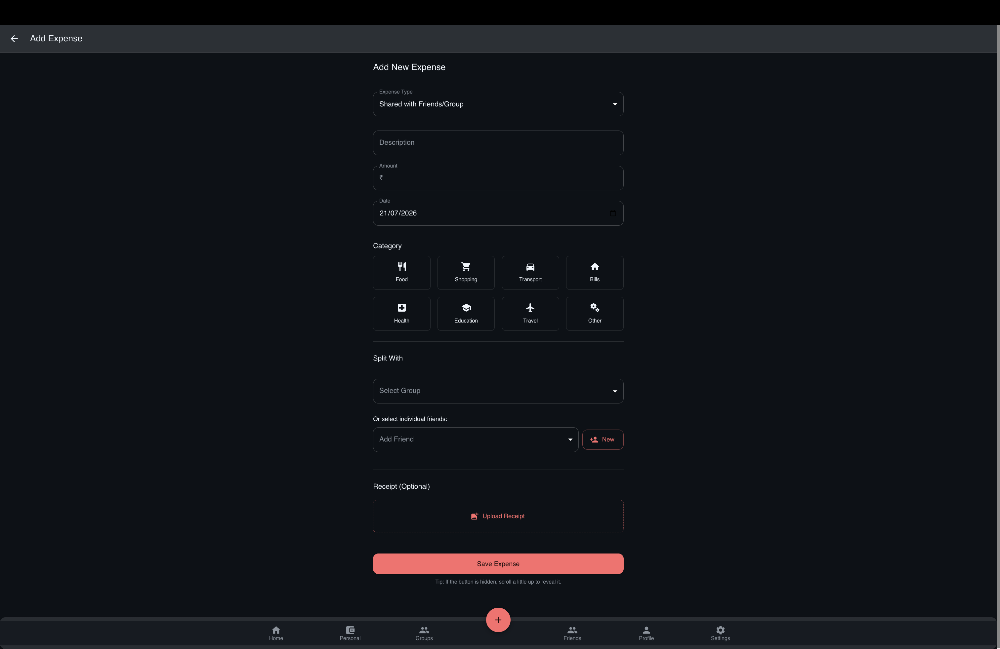
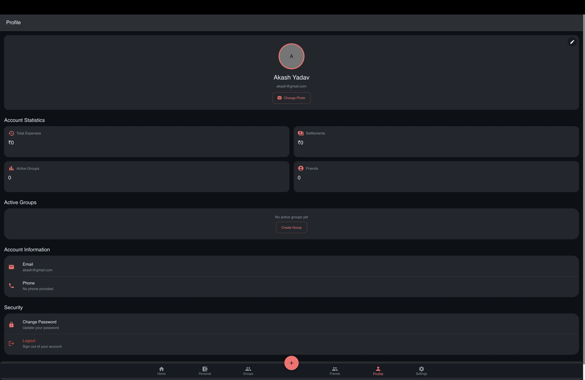
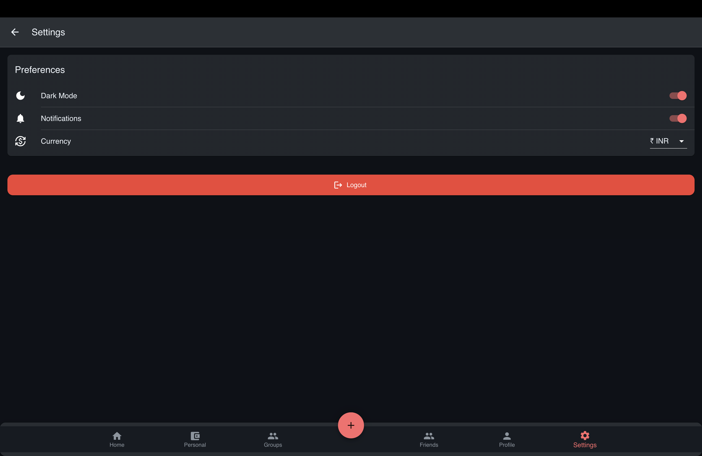

# 💸 Broke Together

A full-stack **MERN Expense Splitting Application** that helps friends and groups manage shared expenses, split bills fairly, and settle balances with ease. Whether it's a trip, dinner, rent, or daily expenses, **Broke Together** makes tracking shared finances simple, transparent, and hassle-free.

---

## ✨ Features

- 🔐 Secure User Authentication (Login & Signup)
- 📊 Interactive Dashboard
- 💸 Add & Manage Shared Expenses
- 👥 Friend Management
- 👨‍👩‍👧‍👦 Group Creation & Management
- 💰 Equal & Custom Expense Splitting
- ✅ Settle Balances
- 🔔 Notifications & Activity Updates
- 👤 User Profile Management
- 🌙 Dark Mode Support
- 📱 Fully Responsive Design

---

## 🛠️ Tech Stack

### Frontend
- React.js
- JavaScript (ES6+)
- CSS3
- Material UI

### Backend
- Node.js
- Express.js

### Database
- MongoDB

### Tools
- Git
- GitHub
- VS Code
- npm

---

## 📂 Project Structure

```text
broke-together/
│
├── public/
├── screenshots/
├── src/
│   ├── components/
│   ├── pages/
│   ├── services/
│   ├── context/
│   ├── utils/
│   └── assets/
│
├── server.js
├── package.json
├── package-lock.json
└── README.md
```

---

## 🚀 Installation

### Clone the Repository

```bash
git clone https://github.com/akkyrao/broke-together.git
```

### Navigate to the Project

```bash
cd broke-together
```

### Install Dependencies

```bash
npm install
```

### Start the Application

```bash
npm start
```

---

# 📸 Application Screenshots

## 🚀 Splash Screen



---

## 🔐 Login Page



---

## 📝 Sign Up Page



---

## 📊 Dashboard



---

## 👥 Friends



---

## 👨‍👩‍👧‍👦 Groups



---

## 💸 Add Expense



---

## 👤 Profile



---

## ⚙️ Settings



---

## 🎯 Key Features

- Track Personal & Group Expenses
- Create & Manage Groups
- Add Friends
- Split Expenses Instantly
- View Balances
- Settle Payments
- Responsive User Interface
- Modern Dashboard
- Dark Mode

---

## 🚀 Future Enhancements

- 🤖 AI-Based Expense Insights
- 📷 OCR Receipt Scanner
- 💳 UPI Payment Integration
- 📈 Monthly Analytics
- 📄 PDF Expense Reports
- 🔔 Push Notifications
- 🌍 Multi-Currency Support

---

## 🤝 Contributing

Contributions are welcome!

1. Fork the repository.
2. Create a feature branch.
3. Commit your changes.
4. Open a Pull Request.

---

## 📄 License

This project is licensed under the **MIT License**.

---

## 👨‍💻 Author

**Akash Yadav**

🎓 B.Tech CSE (Data Science & Artificial Intelligence)  
🏫 BML Munjal University

🔗 GitHub: https://github.com/akkyrao

---

## ⭐ Support

If you found this project helpful, consider giving it a ⭐ on GitHub.

It helps others discover the project and motivates future development.

---

<div align="center">

### ❤️ Made with Love by Akash Yadav ❤️

</div>